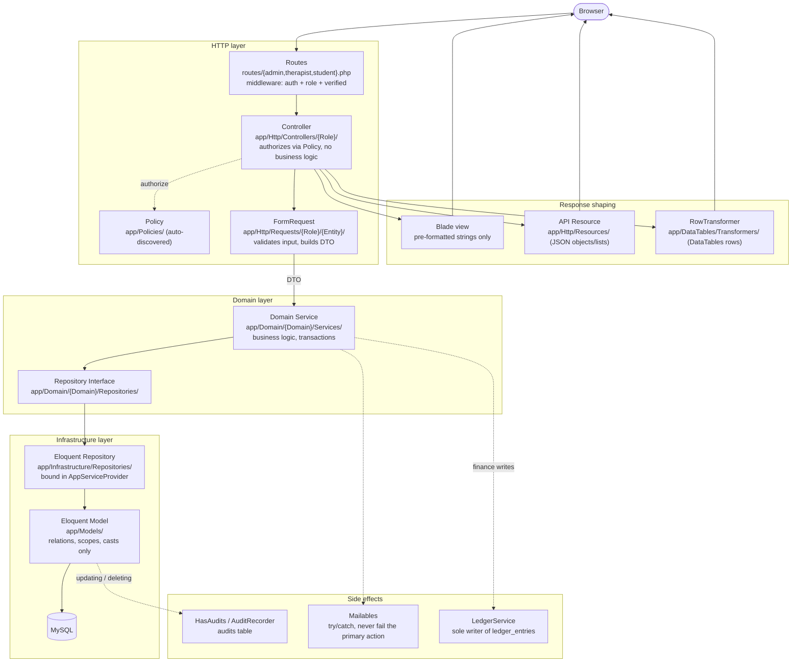

# Application Layers — the request flow every feature follows

Text contract with full rules: [`.claude/rules/ARCHITECTURE.md`](../../.claude/rules/ARCHITECTURE.md).

Key rules the diagram encodes:

- **Controllers never query** — they authorize, delegate to a Service, and shape the response.
- **DTOs carry input** between FormRequest and Service; Services never read the HTTP request.
- **Repositories are the only query layer**; interfaces live in the domain, implementations in infrastructure.
- **Three response shapes**: Blade for pages, API Resources for JSON objects/lists, RowTransformers for DataTables rows (positional HTML arrays — never migrate these to Resources).
- **Side effects never 500 the primary action** — mail/notification failures are logged and swallowed (unless sending *is* the action).
- **`ledger_entries` has exactly one writer**: `LedgerService`.
