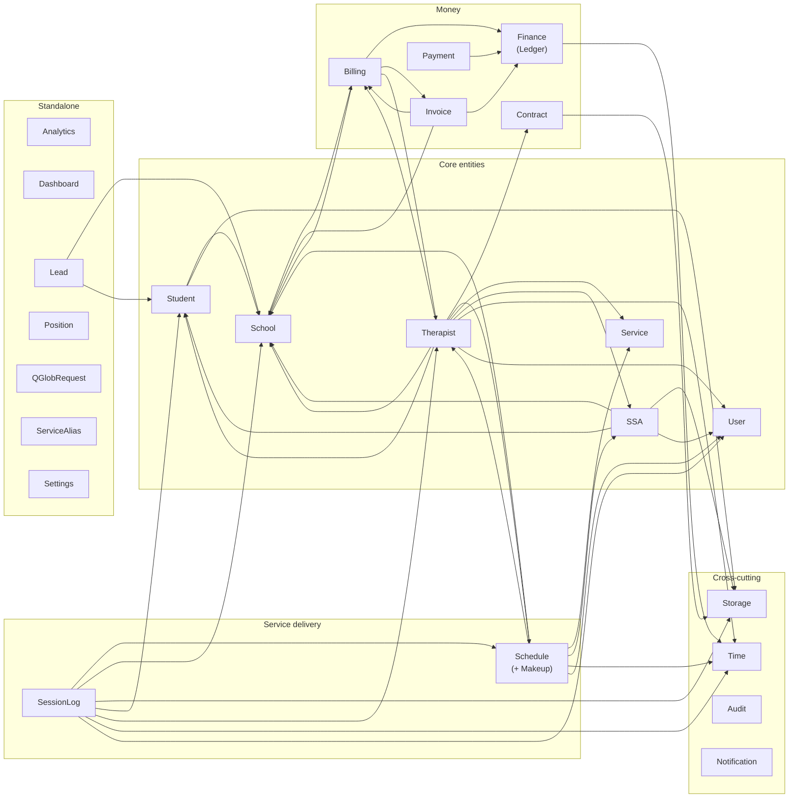

# Domain Map — bounded contexts and their dependencies

One node per directory under `app/app/Domain/`. Edges are **real** — derived from
`use App\Domain\X\...` statements inside each domain (regenerate the data with
the one-liner at the bottom). Leaf domains with no outgoing edges are grouped.



## Reading the map

- **Time** and **Storage** are pure utilities — many inbound edges, zero outbound.
- **Billing ⇄ School** and **Billing ⇄ Invoice** are two-way couplings: Billing
  resolves schedules/defaults from School and creates Invoices; School's billing
  tab and Invoice's generation both call back into Billing. Watch this pair when
  refactoring — it's the tightest knot in the codebase.
- **Therapist** is the widest consumer (9 dependencies) because the therapist
  show page aggregates almost everything (contracts, SSAs, schedules, billing).
- **SessionLog** and **Schedule** form the delivery spine; everything financial
  derives from them.
- **Audit** and **Notification** have no outgoing domain edges — they are invoked
  *by* others (the audit trait/recorder, mailables) and depend on nothing.

## Regenerating the edge data

```bash
cd app/app/Domain && for d in */; do d=${d%/}; \
  grep -rh "^use App\\\\Domain\\\\" "$d" | sed 's/use App.Domain.\([A-Za-z]*\).*/\1/' \
  | sort -u | grep -v "^$d$" | sed "s/^/$d --> /"; done
```
