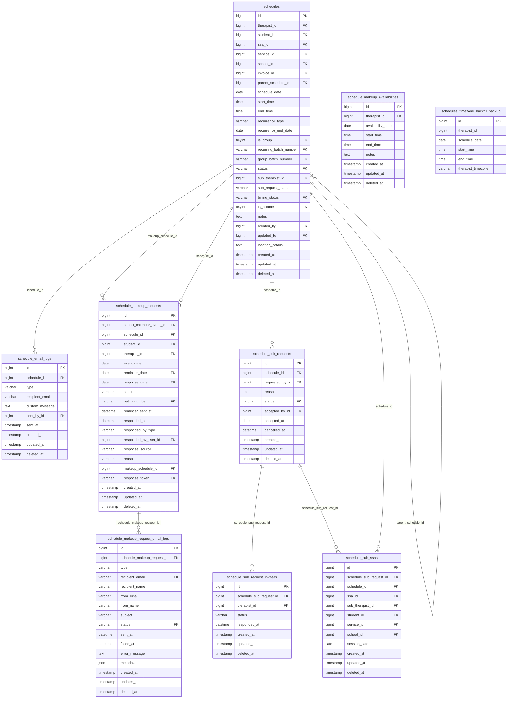

# ERD — Scheduling & Make-Up

> Generated by `make erd`. Edit prose freely — only the marker block is rewritten.

<!-- erd:start -->

<!-- erd:end -->

## Non-obvious facts

- **`schedules.schedule_date` is the UTC calendar date of `start_time`** — never
  display it directly or TZ-shift it; derive display dates from the paired
  datetime. Filter with UTC ranges via `UserTimezoneService::userDayUtcRange()`.
- A booked make-up **is** the rescheduled `schedules` row — there is no separate
  booking table; `schedule_makeup_requests.makeup_schedule_id` links to it.
- `schedules_timezone_backfill_backup` is the reversibility snapshot from the
  local-time→UTC backfill migration — historical, never written by the app.
- A `schedules` row with a make-up request in `sent`/`requested`/`scheduled`
  cannot be deleted (`ScheduleObserver` guard).
