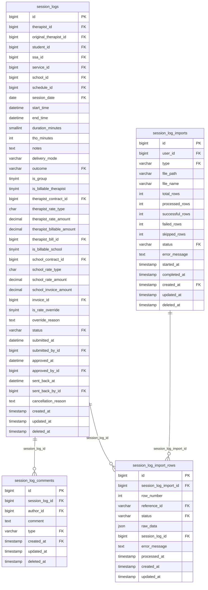

# ERD — Session Logs

> Generated by `make erd`. Edit prose freely — only the marker block is rewritten.

<!-- erd:start -->

```mermaid
erDiagram
    session_logs {
        bigint id PK
        bigint therapist_id FK
        bigint original_therapist_id FK
        bigint student_id FK
        bigint ssa_id FK
        bigint service_id FK
        bigint school_id FK
        bigint schedule_id FK
        date session_date FK
        datetime start_time
        datetime end_time
        smallint duration_minutes
        int tho_minutes
        text notes
        varchar delivery_mode
        varchar outcome FK
        tinyint is_group
        tinyint is_billable_therapist
        bigint therapist_contract_id FK
        char therapist_rate_type
        decimal therapist_rate_amount
        decimal therapist_billable_amount
        bigint therapist_bill_id FK
        tinyint is_billable_school
        bigint school_contract_id FK
        char school_rate_type
        decimal school_rate_amount
        decimal school_invoice_amount
        bigint invoice_id FK
        tinyint is_rate_override
        text override_reason
        varchar status FK
        datetime submitted_at
        bigint submitted_by_id FK
        datetime approved_at
        bigint approved_by_id FK
        datetime sent_back_at
        bigint sent_back_by_id FK
        text cancellation_reason
        timestamp created_at
        timestamp updated_at
        timestamp deleted_at
    }
    session_log_comments {
        bigint id PK
        bigint session_log_id FK
        bigint author_id FK
        text comment
        varchar type FK
        timestamp created_at FK
        timestamp updated_at
        timestamp deleted_at
    }
    session_log_imports {
        bigint id PK
        bigint user_id FK
        varchar type FK
        varchar file_path
        varchar file_name
        int total_rows
        int processed_rows
        int successful_rows
        int failed_rows
        int skipped_rows
        varchar status FK
        text error_message
        timestamp started_at
        timestamp completed_at
        timestamp created_at FK
        timestamp updated_at
        timestamp deleted_at
    }
    session_log_import_rows {
        bigint id PK
        bigint session_log_import_id FK
        int row_number
        varchar reference_id FK
        varchar status FK
        json raw_data
        bigint session_log_id FK
        text error_message
        timestamp processed_at
        timestamp created_at
        timestamp updated_at
    }
    %% session_log_comments.author_id -> users (other group)
    session_logs ||--o{ session_log_comments : "session_log_id"
    session_logs ||--o{ session_log_import_rows : "session_log_id"
    session_log_imports ||--o{ session_log_import_rows : "session_log_import_id"
    %% session_log_imports.user_id -> users (other group)
    %% session_logs.approved_by_id -> users (other group)
    %% session_logs.invoice_id -> invoices (other group)
    %% session_logs.original_therapist_id -> users (other group)
    %% session_logs.schedule_id -> schedules (other group)
    %% session_logs.school_contract_id -> school_contracts (other group)
    %% session_logs.school_id -> schools (other group)
    %% session_logs.sent_back_by_id -> users (other group)
    %% session_logs.service_id -> services (other group)
    %% session_logs.ssa_id -> service_support_agreements (other group)
    %% session_logs.student_id -> users (other group)
    %% session_logs.submitted_by_id -> users (other group)
    %% session_logs.therapist_bill_id -> therapist_bills (other group)
    %% session_logs.therapist_contract_id -> therapist_contracts (other group)
    %% session_logs.therapist_id -> users (other group)
```
<!-- erd:end -->
