# ERD — Billing, Invoices & Therapist Bills

> Generated by `make erd`. Edit prose freely — only the marker block is rewritten.

```mermaid
erDiagram
    invoices {
        bigint id PK
        bigint school_id FK
        varchar invoice_number FK
        date invoice_date
        date billing_period_start FK
        date billing_period_end
        varchar status FK
        varchar billing_mode FK
        decimal subtotal
        decimal tax_total
        decimal total
        decimal carry_forward_balance
        date due_date
        varchar school_name
        varchar school_display_name
        text school_address
        varchar school_state
        varchar school_contact_first_name
        varchar school_contact_last_name
        varchar school_contact_phone
        varchar school_contact_email
        varchar school_invoice_email
        varchar company_name
        text company_address
        varchar company_phone
        varchar company_email
        varchar company_tax_id
        datetime sent_at
        datetime paid_at
        varchar payment_token FK
        bigint sent_by_id FK
        text notes
        timestamp created_at
        timestamp updated_at
        timestamp deleted_at
    }
    invoice_line_items {
        bigint id PK
        bigint invoice_id FK
        varchar line_type
        varchar description
        bigint schedule_id FK
        bigint session_log_id FK
        bigint source_invoice_id FK
        date billing_period_start
        date billing_period_end
        decimal quantity
        decimal unit_price
        decimal total
        int sort_order
        timestamp created_at
        timestamp updated_at
    }
    invoice_email_logs {
        bigint id PK
        bigint invoice_id FK
        varchar type
        varchar recipient_email
        text custom_message
        bigint sent_by_id FK
        timestamp sent_at
        timestamp created_at
        timestamp updated_at
        timestamp deleted_at
    }
    invoice_payments {
        bigint id PK
        bigint school_id FK
        bigint invoice_id FK
        date paid_at FK
        decimal amount
        varchar method FK
        varchar reference
        text notes
        varchar gateway
        varchar gateway_transaction_id
        bigint payment_gateway_transaction_id FK
        bigint recorded_by_id FK
        timestamp created_at
        timestamp updated_at
        timestamp deleted_at
    }
    invoice_payment_allocations {
        bigint id PK
        bigint invoice_id FK
        bigint invoice_payment_id FK
        decimal allocated_amount
        timestamp created_at
        timestamp updated_at
    }
    therapist_bills {
        bigint id PK
        bigint therapist_id FK
        varchar bill_number FK
        date billing_period_start FK
        date billing_period_end
        date bill_date
        varchar status FK
        decimal subtotal
        decimal adjustments_total
        decimal total_due
        date due_date
        varchar therapist_name
        varchar therapist_email
        varchar therapist_phone
        text therapist_address
        varchar company_name
        text company_address
        varchar company_phone
        varchar company_email
        varchar company_tax_id
        datetime sent_at
        datetime paid_at
        bigint sent_by_id FK
        text notes
        timestamp created_at
        timestamp updated_at
        timestamp deleted_at
    }
    therapist_bill_payments {
        bigint id PK
        bigint therapist_id FK
        bigint therapist_bill_id FK
        timestamp paid_at FK
        decimal amount
        varchar method FK
        varchar reference
        text notes
        bigint recorded_by_id FK
        timestamp created_at
        timestamp updated_at
        timestamp deleted_at
    }
    therapist_bill_payment_allocations {
        bigint id PK
        bigint therapist_bill_id FK
        bigint therapist_bill_payment_id FK
        decimal allocated_amount
        timestamp created_at
        timestamp updated_at
    }
    billing_schedules {
        bigint id PK
        varchar schedulable_type FK
        bigint schedulable_id
        varchar schedule_type FK
        varchar billing_mode FK
        varchar frequency
        varchar generation_day_type
        tinyint generation_day_of_week
        int generation_delay_days
        int min_grace_days
        int payment_terms_days
        tinyint auto_generate
        tinyint auto_send
        tinyint is_active FK
        timestamp last_run_at
        date last_period_end
        date next_run_at
        text notes
        date billing_start_date
        timestamp created_at
        timestamp updated_at
        timestamp deleted_at
    }
    billing_schedule_runs {
        bigint id PK
        bigint billing_schedule_id FK
        date billing_period_start
        date billing_period_end
        date generation_date
        varchar status FK
        int sessions_found
        int sessions_from_prior_periods
        int adjustments_count
        decimal adjustment_total
        decimal carry_forward_amount
        bigint invoice_id FK
        bigint therapist_bill_id FK
        decimal total_amount
        tinyint auto_sent
        text error_message
        timestamp started_at
        timestamp completed_at
        timestamp created_at
        timestamp updated_at
    }
    billing_settings {
        bigint id PK
        varchar default_frequency
        varchar default_generation_day_type
        tinyint default_generation_day_of_week
        int default_delay_days
        int default_payment_terms_days
        tinyint default_auto_generate
        tinyint default_auto_send
        varchar advance_default_frequency
        varchar advance_default_generation_day_type
        tinyint advance_default_generation_day_of_week
        int advance_default_delay_days
        int advance_default_payment_terms_days
        tinyint advance_default_auto_generate
        tinyint advance_default_auto_send
        varchar standard_default_frequency
        varchar standard_default_generation_day_type
        tinyint standard_default_generation_day_of_week
        int standard_default_delay_days
        int standard_default_payment_terms_days
        tinyint standard_default_auto_generate
        tinyint standard_default_auto_send
        int reminder_days_before_due
        int reminder_days_after_due
        int reminder_overdue_repeat_days
        int max_overdue_reminders
        timestamp updated_at
    }
    billing_reminders {
        bigint id PK
        varchar remindable_type FK
        bigint remindable_id
        varchar reminder_type FK
        timestamp sent_at
        timestamp created_at
        timestamp updated_at
    }
    advance_reconciliations {
        bigint id PK
        bigint billing_schedule_id FK
        bigint school_id FK
        date reconciled_period_start
        date reconciled_period_end
        bigint source_invoice_id FK
        bigint credit_note_ledger_entry_id FK
        bigint settlement_invoice_id FK
        decimal net_amount
        timestamp reconciled_at
        bigint recorded_by_id FK
        timestamp created_at
        timestamp updated_at
        timestamp deleted_at
    }
    therapist_contracts {
        bigint id PK
        bigint therapist_id FK
        date start_date FK
        date end_date
        text notes
        varchar document_path
        varchar document_name
        varchar document_mime_type
        bigint document_size
        varchar status FK
        timestamp created_at
        timestamp updated_at
        timestamp deleted_at
    }
    therapist_contract_services {
        bigint id PK
        bigint therapist_contract_id FK
        bigint service_id FK
        decimal rate
        char rate_type
        decimal no_show_rate
        char no_show_rate_type
        timestamp created_at
        timestamp updated_at
    }
    billing_schedules ||--o{ advance_reconciliations : "billing_schedule_id"
    %% advance_reconciliations.credit_note_ledger_entry_id -> ledger_entries (other group)
    %% advance_reconciliations.recorded_by_id -> users (other group)
    %% advance_reconciliations.school_id -> schools (other group)
    invoices ||--o{ advance_reconciliations : "settlement_invoice_id"
    invoices ||--o{ advance_reconciliations : "source_invoice_id"
    billing_schedules ||--o{ billing_schedule_runs : "billing_schedule_id"
    invoices ||--o{ billing_schedule_runs : "invoice_id"
    therapist_bills ||--o{ billing_schedule_runs : "therapist_bill_id"
    invoices ||--o{ invoice_email_logs : "invoice_id"
    %% invoice_email_logs.sent_by_id -> users (other group)
    invoices ||--o{ invoice_line_items : "invoice_id"
    %% invoice_line_items.schedule_id -> schedules (other group)
    %% invoice_line_items.session_log_id -> session_logs (other group)
    invoices ||--o{ invoice_line_items : "source_invoice_id"
    invoices ||--o{ invoice_payment_allocations : "invoice_id"
    invoice_payments ||--o{ invoice_payment_allocations : "invoice_payment_id"
    invoices ||--o{ invoice_payments : "invoice_id"
    %% invoice_payments.payment_gateway_transaction_id -> payment_gateway_transactions (other group)
    %% invoice_payments.recorded_by_id -> users (other group)
    %% invoice_payments.school_id -> schools (other group)
    %% invoices.school_id -> schools (other group)
    %% invoices.sent_by_id -> users (other group)
    therapist_bills ||--o{ therapist_bill_payment_allocations : "therapist_bill_id"
    therapist_bill_payments ||--o{ therapist_bill_payment_allocations : "therapist_bill_payment_id"
    %% therapist_bill_payments.recorded_by_id -> users (other group)
    therapist_bills ||--o{ therapist_bill_payments : "therapist_bill_id"
    %% therapist_bill_payments.therapist_id -> users (other group)
    %% therapist_bills.sent_by_id -> users (other group)
    %% therapist_bills.therapist_id -> users (other group)
    %% therapist_contract_services.service_id -> services (other group)
    therapist_contracts ||--o{ therapist_contract_services : "therapist_contract_id"
    %% therapist_contracts.therapist_id -> therapist_profiles (other group)
```

<!-- erd:start -->

<!-- erd:end -->

## Non-obvious facts

- **Standard invoices don't write `invoice_line_items`** — they link
  `session_logs.invoice_id` directly. Only Advance invoices populate line items
  (with `schedule_id` for prepaid charges, `session_log_id` for reconciliation).
- `billing_mode = advance` is written in exactly one place:
  `AdvanceBillingService::createAdvanceInvoice()`.
- Invoice `school_*`/`company_*` columns are **snapshots** frozen at creation —
  invoices never change when the school record is edited later.
- `billing_schedules.next_run_at` is the only "is it due" signal the daily cron
  checks; period math happens at write time, not at run time.
