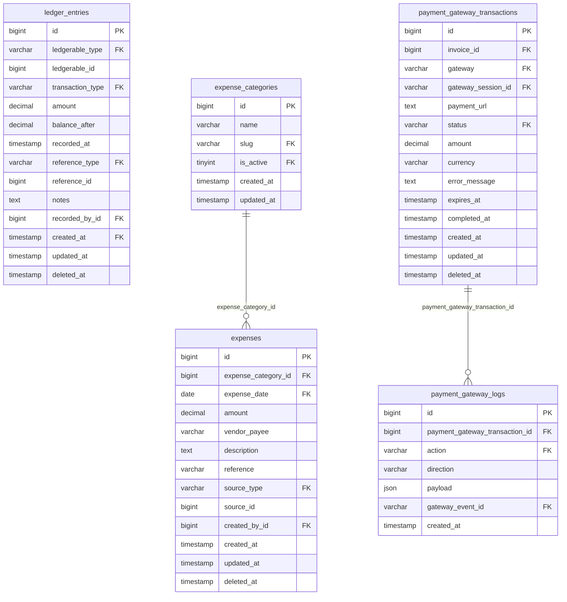

# ERD — Finance & Ledger

> Generated by `make erd`. Edit prose freely — only the marker block is rewritten.

<!-- erd:start -->

<!-- erd:end -->

## Non-obvious facts

- **`ledger_entries` has exactly one writer: `LedgerService`.** Sign convention
  lives in `TransactionType::balanceDelta()` — never hardcode +/-.
- **`balance_after` invariant**: for each account ordered by `(recorded_at, id)`,
  every row's stored balance equals the running signed sum. `php artisan
  ledger:verify` audits it; backdated writes trigger a full chain recompute.
- `ledgerable` is polymorphic: `School` = accounts receivable, `User` (therapist)
  = accounts payable.
- Soft-deleted rows are conceptually erased — raw queries (`DB::table`,
  `withTrashed`) will double-count them; always go through the model.
