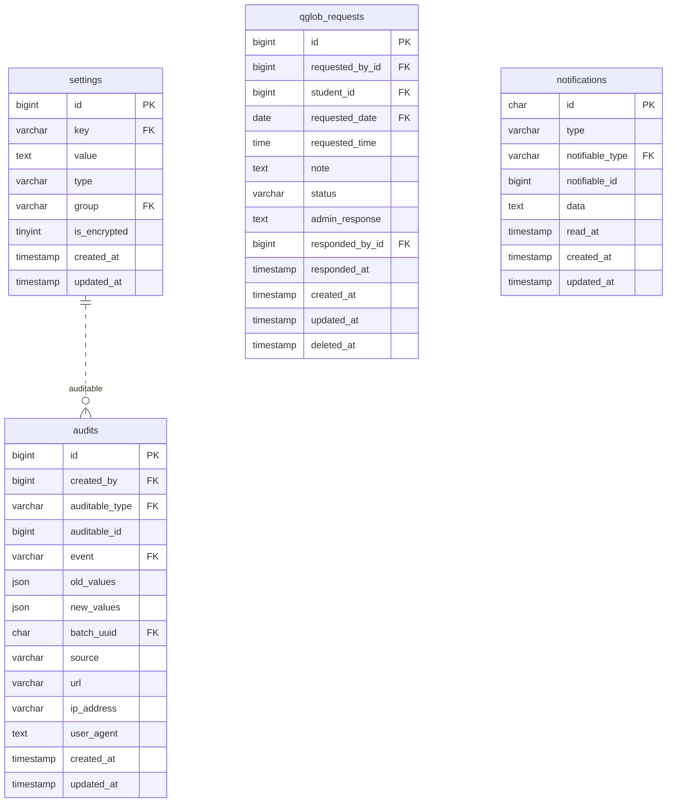

# ERD — Platform (Audit, Settings, QGlob)

> Generated by `make erd`. Edit prose freely — only the marker block is rewritten.

<!-- erd:start -->

```mermaid
erDiagram
    audits {
        bigint id PK
        bigint created_by FK
        varchar auditable_type FK
        bigint auditable_id
        varchar event FK
        json old_values
        json new_values
        char batch_uuid FK
        varchar source
        varchar url
        varchar ip_address
        text user_agent
        timestamp created_at
        timestamp updated_at
    }
    settings {
        bigint id PK
        varchar key FK
        text value
        varchar type
        varchar group FK
        tinyint is_encrypted
        timestamp created_at
        timestamp updated_at
    }
    qglob_requests {
        bigint id PK
        bigint requested_by_id FK
        bigint student_id FK
        date requested_date FK
        time requested_time
        text note
        varchar status
        text admin_response
        bigint responded_by_id FK
        timestamp responded_at
        timestamp created_at
        timestamp updated_at
        timestamp deleted_at
    }
    notifications {
        char id PK
        varchar type
        varchar notifiable_type FK
        bigint notifiable_id
        text data
        timestamp read_at
        timestamp created_at
        timestamp updated_at
    }
    %% audits.created_by -> users (other group)
    %% qglob_requests.requested_by_id -> users (other group)
    %% qglob_requests.responded_by_id -> users (other group)
    %% qglob_requests.student_id -> users (other group)
    %% audits.auditable ~> school_contracts (polymorphic, other group)
    %% audits.auditable ~> school_contract_services (polymorphic, other group)
    %% audits.auditable ~> therapist_contracts (polymorphic, other group)
    %% audits.auditable ~> therapist_contract_services (polymorphic, other group)
    %% audits.auditable ~> service_support_agreements (polymorphic, other group)
    %% audits.auditable ~> ledger_entries (polymorphic, other group)
    %% audits.auditable ~> schools (polymorphic, other group)
    %% audits.auditable ~> users (polymorphic, other group)
    %% audits.auditable ~> student_profiles (polymorphic, other group)
    %% audits.auditable ~> therapist_profiles (polymorphic, other group)
    %% audits.auditable ~> parent_profiles (polymorphic, other group)
    %% audits.auditable ~> admin_profiles (polymorphic, other group)
    %% audits.auditable ~> services (polymorphic, other group)
    %% audits.auditable ~> positions (polymorphic, other group)
    settings ||..o{ audits : "auditable"
    %% audits.auditable ~> expenses (polymorphic, other group)
    %% audits.auditable ~> expense_categories (polymorphic, other group)
    %% audits.auditable ~> schedule_makeup_requests (polymorphic, other group)
```
<!-- erd:end -->
