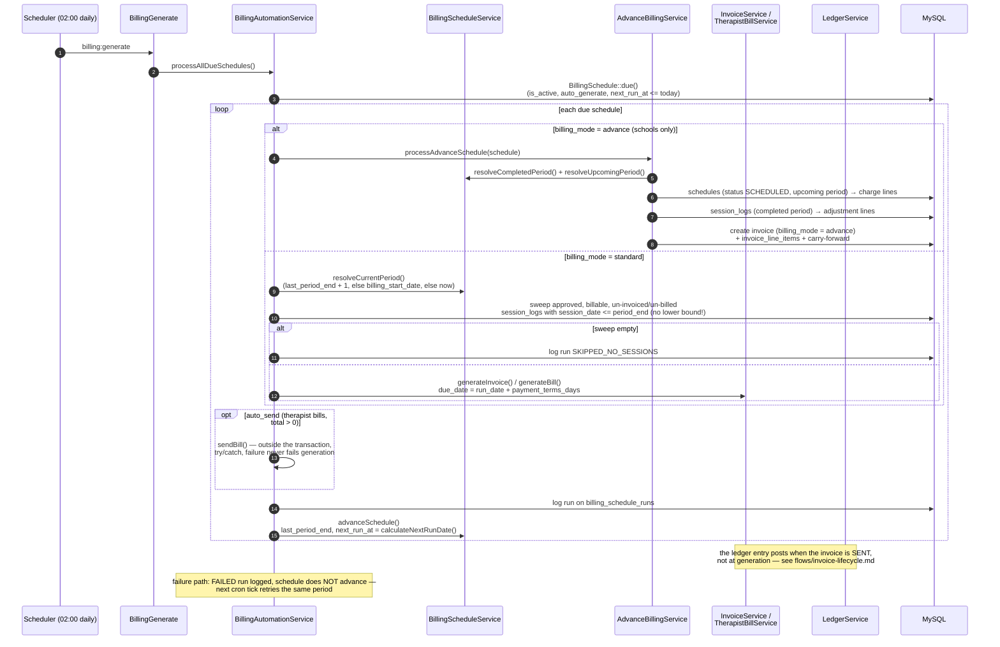

# Flow — Daily billing automation (`billing:generate`)

Full runtime reference: [`.claude/rules/BILLING_AUTOMATION_RUNTIME.md`](../../../.claude/rules/BILLING_AUTOMATION_RUNTIME.md).

Facts worth remembering while reading code:

- `next_run_at` is the **only** "is it due" check — no frequency math happens at cron time.
- The sweep has **no lower date bound**: old un-billed approved sessions ride into the next bill by design.
- Only `AdvanceBillingService::createAdvanceInvoice()` ever writes `billing_mode = advance`.
