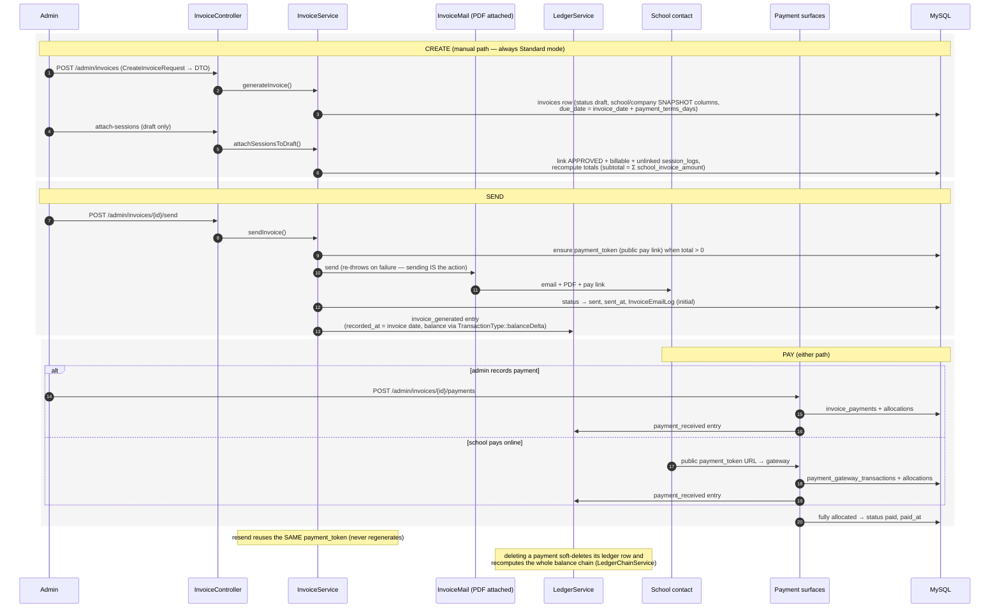

# Flow — Invoice lifecycle (draft → sent → paid → ledger)

Full reference: [`.claude/rules/INVOICING.md`](../../../.claude/rules/INVOICING.md).

```mermaid
sequenceDiagram
    autonumber
    participant Admin
    participant Ctrl as InvoiceController
    participant Svc as InvoiceService
    participant Mail as InvoiceMail (PDF attached)
    participant Ledger as LedgerService
    participant School as School contact
    participant Pay as Payment surfaces
    participant DB as MySQL

    rect rgb(245,245,245)
        note over Admin,DB: CREATE (manual path — always Standard mode)
        Admin->>Ctrl: POST /admin/invoices (CreateInvoiceRequest → DTO)
        Ctrl->>Svc: generateInvoice()
        Svc->>DB: invoices row (status draft, school/company SNAPSHOT columns,<br/>due_date = invoice_date + payment_terms_days)
        Admin->>Ctrl: attach-sessions (draft only)
        Ctrl->>Svc: attachSessionsToDraft()
        Svc->>DB: link APPROVED + billable + unlinked session_logs,<br/>recompute totals (subtotal = Σ school_invoice_amount)
    end

    rect rgb(245,245,245)
        note over Admin,DB: SEND
        Admin->>Ctrl: POST /admin/invoices/{id}/send
        Ctrl->>Svc: sendInvoice()
        Svc->>DB: ensure payment_token (public pay link) when total > 0
        Svc->>Mail: send (re-throws on failure — sending IS the action)
        Mail->>School: email + PDF + pay link
        Svc->>DB: status → sent, sent_at, InvoiceEmailLog (initial)
        Svc->>Ledger: invoice_generated entry<br/>(recorded_at = invoice date, balance via TransactionType::balanceDelta)
    end

    rect rgb(245,245,245)
        note over School,DB: PAY (either path)
        alt admin records payment
            Admin->>Pay: POST /admin/invoices/{id}/payments
            Pay->>DB: invoice_payments + allocations
            Pay->>Ledger: payment_received entry
        else school pays online
            School->>Pay: public payment_token URL → gateway
            Pay->>DB: payment_gateway_transactions + allocations
            Pay->>Ledger: payment_received entry
        end
        Pay->>DB: fully allocated → status paid, paid_at
    end

    Note over Svc: resend reuses the SAME payment_token (never regenerates)
    Note over Ledger: deleting a payment soft-deletes its ledger row and<br/>recomputes the whole balance chain (LedgerChainService)
```
