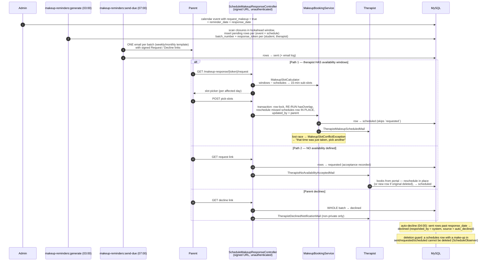

# Flow — School closure → make-up request → parent self-reschedule

Full reference: [`.claude/rules/SCHEDULE_MAKEUP_REQUESTS.md`](../../../.claude/rules/SCHEDULE_MAKEUP_REQUESTS.md).

```mermaid
sequenceDiagram
    autonumber
    participant Admin
    participant Gen as makeup-reminders:generate (03:00)
    participant Send as makeup-reminders:send-due (07:00)
    participant Parent
    participant Pub as ScheduleMakeupResponseController<br/>(signed URL, unauthenticated)
    participant Book as MakeupBookingService
    participant Therapist
    participant DB as MySQL

    Admin->>DB: calendar event with request_makeup = true<br/>+ reminder_date + response_date
    Gen->>DB: scan closures in lookahead window,<br/>insert pending rows per (event × schedule)<br/>batch_number + response_token per (student, therapist)
    Send->>Parent: ONE email per batch (weekly/monthly template)<br/>with signed Request / Decline links
    Send->>DB: rows → sent (+ email log)

    alt Path 1 — therapist HAS availability windows
        Parent->>Pub: GET /makeup-response/{token}/request
        Pub->>Book: MakeupSlotCalculator:<br/>windows − schedules → 15-min sub-slots
        Pub-->>Parent: slot picker (per affected day)
        Parent->>Pub: POST pick-slots
        Pub->>Book: transaction: row-lock, RE-RUN hasOverlap,<br/>reschedule missed schedules row IN PLACE,<br/>updated_by = parent
        Book->>DB: row → scheduled (skips `requested`)
        Book->>Therapist: TherapistMakeupScheduledMail
        Note over Book: lost race → MakeupSlotConflictException<br/>→ "that time was just taken, pick another"
    else Path 2 — NO availability defined
        Parent->>Pub: GET request link
        Pub->>DB: rows → requested (acceptance recorded)
        Pub->>Therapist: TherapistNoAvailabilityAcceptedMail
        Therapist->>DB: books from portal — reschedule in place<br/>(or new row if original deleted), → scheduled
    else Parent declines
        Parent->>Pub: GET decline link
        Pub->>DB: WHOLE batch → declined
        Pub->>Therapist: TherapistDeclinedNotificationMail (non-private only)
    end

    Note over DB: auto-decline (04:00): sent rows past response_date →<br/>declined (responded_by = system, source = auto_declined)
    Note over DB: deletion guard: a schedules row with a make-up in<br/>sent/requested/scheduled cannot be deleted (ScheduleObserver)
```
