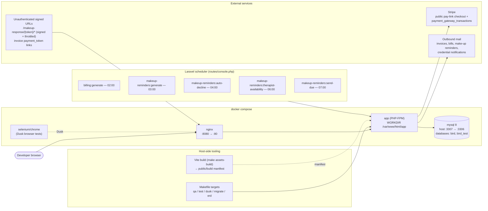

# Infrastructure Topology

## Local development (from `docker-compose.yml` — authoritative)

Facts encoded here:

- The app container's WORKDIR is `/var/www/html/app` — never `cd app` inside it.
- Tests use the `bird_test` database on the same MySQL service; `make erd` also
  uses `bird_test` (fresh-migrated) so diagrams reflect the branch's migrations,
  not local dev-data drift.
- All scheduled work runs through Laravel's scheduler — there are no raw OS
  cron entries that bypass artisan.

## Staging / production

> **TODO(confirm with Akshay)** — to be drawn from real facts, not inferred.
> The checklist of needed details lives in
> [`prd/PRD-architecture-and-database-diagrams.md` §7](../../prd/PRD-architecture-and-database-diagrams.md)
> (hosting layout, queue driver & workers, scheduler trigger, storage driver,
> mail provider, MySQL hosting/backups, Stripe mode, monitoring).

Known production-relevant constraints already enforced in code:

- **Staging MySQL lacks the named-timezone tables** — `CONVERT_TZ` is unusable;
  every timezone conversion happens in PHP/Carbon (see TIMEZONE_GUIDE).
- Public surfaces that must be reachable without auth: Stripe webhook/checkout
  return URLs, invoice `payment_token` links, signed make-up response links.
